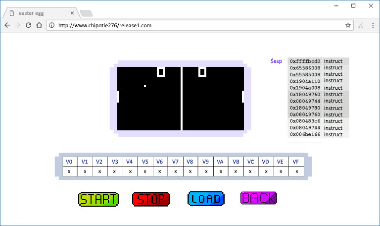

# Team 15 CHIPotle: Product Document

| <- [Index](../Index.md) |

## Project Introduction

  Our project is centered around creating a virtual machine which can run CHIP-8, a low level language designed in the 1970s. Due to the simplicity of its design, the CHIP-8 can be implemented on almost every platform.
  
  The Telmac 1800 and COSMAC VIP were the first computers to run CHIP-8 programs and with only 4096 bytes of memory along with the
  interpreter occupying the first 512 bytes, all programs were designed considering a limited amount of memory. The CHIP-8 is known for being able to run classic games such as Tetris,
  Pong, or Pac-man.

  The goal of our project is to build a working CHIP-8 virtual machine, an interactive website to use the CHIP-8 virtual machine, and at least two games along with useful tools for the team members. The final product would in theory be
  able to run any CHIP-8 program.

## Meeting Schedule

|Week|Date|Release Priority|Notes|Minutes|
|---:|:---:|:---:|:---:|:---:|
|**1**|N/A|N/A|N/A|N/A|
|**2**|January 7|Release 0| |[Week 2](meeting-minutes/Week-2.md)|
|**3**|January 14|Release 0| |[Week 3](meeting-minutes/Week-3.md)|
|**4**|January 21|Release 1| |[Week 4](meeting-minutes/Week-4.md)|
|**5**|January 28|Release 1| |[Week 5](meeting-minutes/Week-5.md)|
|**6**|February 4|Release 1| |[Week 6](meeting-minutes/Week-6.md)|
|**7**|February 11|Release 2| |[Week 7](meeting-minutes/Week-7.md)|
|**8**|February 25|Release 2| | |
|**9**|March 4|Release 3| | |
|**10**|March 11|Release 3| | |
|**11**|March 18|Release 4| | |
|**12**|March 25|Release 4| | |
|**13**|April 1|Release 4| | |
|**14**|N/A|N/A|Code freeze in-effect|N/A|

## Project Deliverables and Tools

This section contains all deliverables and tools that we are currently planning to create, in-progress in creating, or have completed.

### In Progress

- [**CHIP-8 Assembler**](item-description/Assembler/index.md)
- [**CHIP-8 Programs**](item-description/chip8-programs.md)

### Finalizing

This stage is perhaps the longest one as this includes validation, improvements, and optimizations.

- [**CHIP-8 Emulator**](item-description/chip8-emulator.md)
  - Opcodes
  - General Architecture
- [**CHIP-8 Visualizer Website**](item-description/chip8-website.md)
- [**CHIP-8 Sprite Maker**](item-description/Sprite-Maker.md)

### Finished

- **Automated Repository Tests**
  - Implemented with CircleCI and Jest
- **Simple Contribution Tool**
  - Project-specific tools to help maintain repository
- **Local Unit Test System**
  - Implemented with Jest
  - This does not include module-specific tests.  
  This only includes the general test system.
- **Build System**
- **Project-Specific Standard Library**
  - Wrapper and utility classes for numerical values

### Future

## Communication

Group members communicate *through in-person meetings*, *Discord*, *GitHub issues*, and *SFU emails*.

### Via GitHub

Group members use GitHub issues for formal bug reports, feature requests, and code reviews. Features provided by GitHub help organize and manage issues through the use of **labels, assignees, and milestones**.

- **Labels**: Useful for organizing and filtering different types of issues.
- **Assignees**: Developers that are responsible for the issue.
- **Milestones**: Group of issues that correspond to a goal or feature.

The issue tracker will be used to identify components that need to be finished, and the developers assigned to them.

### Via Meetings

The group plans to schedule meetings on Monday every week from **12:30 pm to 2:00 pm** (Between CMPT 276 lecture and CMPT 213 lecture). Group members decide location through Discord and attempt to book rooms for major meetings. Members can leave at any time but are encouraged to the end of the meetings. It is possible to end the meetings when only one member is left attending.

At the meetings (Scrum-style), group members discuss **weekly progress updates**, **issues encountered along the way**, and **planning for the following week's activities and milestones**.

Members may request additional meetings where full attendance are not required. These additional meetings mainly focus on group-oriented work, with no documentation needed unless requested.

### Via Discord

Group members use Discord as an informal communication channel to discuss feature ideas or implementation details. Relevant discussions are added to the project documentation or used as the basis for a GitHub issue.

Group members view announcements on Discord. Members can break down into smaller groups to discuss and work on minor issues using Discord.

### Via SFU Mail

Reserved for emergencies such as unable to contact a team member via the above methods.

## Implementation Language

We will be using TypeScript to implement the CHIP-8 emulator.

TypeScript was chosen over JavaScript because TypeScript is a statically typed, "compilied" language. Static typing will help the developers transition from familiar statically typed languages such as C++ and Java. "Compilation" support is also seen as a benefit as syntax and control flow errors can be flagged immediately before ever being shipped.

*Note that we use the term "compile" loosely when referring to TypeScript. More accurately, TypeScript is **transpiled** into JavaScript. Code in TypeScript is parsed and transformed into equivalent JavaScript code, which is used in the final product.*

TypeScript supports and polyfills the `async` and `await` keywords introduced in ECMAScript 7, which enable developers to operate on asynchronous JavaScript Promises as though they were synchronous constructs. In theory, the CHIP-8 CPU shouldn't need asynchronous code, but other components may benefit.

The CHIP-8 emulator and debugging engine will be designed with object-oriented principles and modularity in mind.

Major libraries and tools are discussed later in the document.

## Testing

Testing is done through the use of [Jest](https://jestjs.io/) unit tests. Tests are implemented on a per-module basis and are intended to prevent regressions and ensure that the code works as intended by the developers.

As well as being accessible to developers through the use of the `sct test` tool, the repository is automatically tested by CircleCI. On every commit, CircleCI will validate the project source code to ensure that it meets the project styling and code of conduct guidelines, as well as build and test the project in its entirety.

## Software Repository

We will use GitHub to host our private repository.

Developers should **NOT** attempt to work directly on the master branch.  
The master branch is protected and any attempts to commit directly will be automatically rejected by your git installation.

Please create your own development branch and work on that. Once your changes are complete, create a pull request `yourbranch -> master` in GitHub.

Pull requests will be automatically tested by CircleCI. If a pull request passes all tests (you will see green check marks), it will be avaliable for merging after team review.

To ensure consistent commit quality, git hooks have been implemented repository wide.
These hooks will prevent you from creating commits that violate any of the following conditions:

- Formatting checks must pass.
- Profanity checks must pass.
- The commit message must follow this format: `[module]: [verb] [changes]`
  - Where `[module]` is a module in `sct info --list-modules`
  - Where `[changes]` does not end in punctuation.
  - Where `[verb]` is one of the following:
    - `Add`
    - `Change`
    - `Fix`
    - `Move`
    - `Refactor`
    - `Reformat`
    - `Rename`
    - `Remove`
    - `Update`

Before committing changes, please run `sct check` and `sct fmt`.

### Major Refactoring

When planning major refactors, please create an issue ticket on GitHub so that all team members are aware of your intentions. Creating the ticket will help avoid any major merge conflicts where work by one member becomes redundant.

## Developer Environment

### Repository Tools

The project repository contains in-house tools which will help developers maintain code and repository quality.

#### Simple Contribution Tool

**sct** is the command file to execute in the repository root directory.  
To execute sct in Non-Windows systems, use `./sct`.  
To execute sct in Windows systems, use `./sct` if in PowerShell, or `sct` if in Command Prompt.

To view the command list in terminal, execute sct without any trailing commands or flags.

A command in the following table is executed as follows: `sct command`.

|Command|Purpose|
|-------|-------|
|build  |Build the project|
|check  |Check source code for guideline violations|
|dev    |Build the project and host the website on a local webserver|
|fmt    |Format source code|
|help   |View subcommand help|
|info   |View project info|
|init   |Initialize the project|
|test   |Run module tests|

**NOTE: `sct dev` does not compile TypeScript. Run `sct build` before `sct dev`.**

### Linux Environment Requirements

For the sake of consistency, we assume that a fresh install of [Ubuntu 18.10](https://www.ubuntu.com/download/desktop) will be the environment. If you wish to use a VM, we suggest VMware Workstation Pro 15 provided through the [SFU-VMAP partnership](https://services.cs.sfu.ca/).

Please install all of the following packages before executing `./sct init`.

All packages listed (**exception to nodejs**) may be installed through the `apt` command.
To install nodejs, please [refer to nodejs documentation.](https://github.com/nodesource/distributions/blob/master/README.md#deb)
nodejs through `apt` will yield an outdated version.

- **Language Packages**
  - `g++`
  - `python2.7`
  - `nodejs` 10.15, or later
- **Tool Packages**
  - `curl`
  - `git`
  - `git-lfs`
  - `make`
  - `node-gyp`
  - `libcurl4-openssl-dev`
  - `libssl-dev`
  - `build-essential`

### Windows Environment Requirements

Developers may use Windows machines for this project.  
The requirement for *Windows Subsystem for Linux* has been deprecated.

- **Required Installations**
  - [NodeJS for Windows](https://nodejs.org/en/)
  - [Git for Windows](https://git-scm.com/downloads)
- **Optional Installations**
  - [Visual Studio Code](https://code.visualstudio.com/)
    - *Recommended Plugins*
      - [GitLens](https://marketplace.visualstudio.com/items?itemName=eamodio.gitlens)
      - [Markdown Preview Github Styling](https://marketplace.visualstudio.com/items?itemName=bierner.markdown-preview-github-styles)
      - [markdownlint](https://marketplace.visualstudio.com/items?itemName=DavidAnson.vscode-markdownlint)

### Detailed Setup Instructions for MacOS, Ubuntu and Windows

[Setup Page](../developer/Setup.md)

## Software Development Process

### Project Guidelines

- Source code will remain compatible for transpilation to ES6 JavaScript.
- Source code will be formatted according to a team standard.
  - You can use *sct* to do this for you.
- Source code will not contain any swear words.
- Members will contribute a fair amount of work.
  - Unfair discrepancies will be tracked for the class end-of-term review.
  - All public-facing documentation will include a contributor report.
  - "fair" will not be semantically analyzed and parsed through legalese. Don't be unreasonable.

### Work Breakdown

We will be using the incremental development model for this project. Work will be broken into different releases, where the work of previous releases serve as backbones for future releases. We may consider this breaking up of work to similarly model a dependency graph. Tooling such as test systems and build systems are universally useful, so they will have initial focus.

Unit tests will have to be written at the same time as development. We do not want to have to write all relevant tests during the final days of release.

To view what tasks to do, visit the GitHub issue tracker.
Members will be assigned tasks and will be welcome to contribute to any others.

If a developer accepts a task, they will be given a due date. The due date will at the latest target several days before the Release. This buffer time is required for analysis for the next release, and code review in the current release.

#### Release 0 - Documentation, General Analysis, and Back-End (04/01/2019 - 18/01/2019)

|Task|Date|Timeframe|Status|
|----|----|---------|------|
|**Start Product Document**|04/01/2019|1 day|Finished|
|**Setup Discord Server**|04/01/2019|1 day|Finished|
|**Setup GitHub Repository**|04/01/2019|1 day|Finished|
|**Update Product Document**|04/01/2019|2 weeks|Finished|
|**Setup Tools**|04/01/2019|2 weeks|Finished|
|**Setup Testing Platform**|04/01/2019|1 week|Finished
|**CHIP-8 R&D Emulator**|10/01/2019|2 days|Finished|
|**CHIP-8 R&D Bouncing DVD Logo**|15/01/2019|2 days|Finished|
|**Release Product Document**|18/01/2019|2 weeks|Finished|

We will be creating the initial product document.  
The product document will at minimum satisfy the requirements as laid out on the [project page](http://www.cs.sfu.ca/CourseCentral/276/tjd/project.html).  
The product document will include details on each module. These details will range from who is working on it, to how to understand the module.

We will have the back-end of the project setup so that we will have a much easier time during future releases.

We will also create a library of objects that we have determined to be useful for this project.

##### Emulator Version 0 - R&D Build

To learn the CHIP-8 and understand assembly programming, a simple CHIP-8 emulator was put together. This CHIP-8 has almost all functionality except for key input, sound output and timers. It can support simple non-interactive programs.

A bouncing DVD logo screensaver was made to show the capabilities of the prototype emulator. [YouTube Link](https://www.youtube.com/watch?v=ovqTiFKSjRg). We credit *The Office* and Jarod Forbes for the idea.

#### Release 1 - Emulator I & Tools (19/01/2019 - 06/02/2019)

|Task|Date|Timeframe|Status|
|----|----|---------|------|
|**CHIP-8 Emulator, excluding reverse stepping**|19/01/2019|2 weeks|Finished|
|**CHIP-8 Opcodes**|19/01/2019|1 week|Finished|
|**CHIP-8 Website, including Debugger**|19/01/2019|2 weeks|Finished|
|**CHIP-8 Basic Programs**|19/01/2019|1 week|Finished|

We will be releasing an initial minimum-viable-product emulator.  
The emulator will be able to perform the the basic operation codes of the [CHIP-8 specification](https://en.wikipedia.org/wiki/CHIP-8).  
The emulator will be able to render the screen, memory details and output sound to a HTML5 webpage.  
The emulator will at minimum be able to support basic, non-interactive programs such as simple looping "screensavers".

##### Post-Release Notes

We are ahead by one release since the emulator and website have pretty much been completed. Further releases will only improve website functionality or deal with bug fixes.
The website can be found [here](https://chip.netlify.com).

##### List of Items

- **CHIP-8 VM**
  - Full operation code support
  - Full graphics output
  - Full sound output
  - Interactive input not officially required
- **Basic CHIP-8 Webpage Interface**
  - Render CHIP-8 display, counters, registers, and stack.
  - We hope to enable interactive support with key presses.
  - **Website Design Prototype**
  
  - **CHIP-8 Prototype**
    - [Link](https://macedir.github.io/chip8/)

##### Module design

- CHIP-8 System
  - CHIP-8 CPU
    - CHIP-8 counters, registers, and stack
    - CHIP-8 Opcode Jumptable
    - CHIP-8 Timer
  - CHIP-8 Graphics
    - Graphics Array
  - CHIP-8 Sound
  - CHIP-8 Webpage
    - HTML5 Canvas Object Renderer
  - **Notes:**
    - System Abstraction Layers will only be able to communicate *iff* they differ by exactly one level.
      - Abstraction Layer 0: CPU
      - Abstraction Layer 1: System: Graphics, Sound, Input
      - Abstraction Layer 2: Webpage
  
#### Release 2 - Programs (07/02/2019 - 27/02/2019)

##### Reflection on Release 1

Since the emulator and website visualizer were pretty much done during release 1, we will instead focus on programs during release 2. This also means that we are one release ahead of schedule.

|Task|Date|Timeframe|Status|
|----|----|---------|------|
|**CHIP-8 Optimizations and Validation**|07/02/2019|Entire release|Started|
|**CHIP-8 Program: Brick Breaker**|07/02/2019|15 days|Complete|
|**CHIP-8 Program: Google Dinosaur**|07/02/2019|15 days|Complete|
|**CHIP-8 Program: Snake**|07/02/2019|15 days|Not started|
|**CHIP-8 Program: Space Invaders**|07/02/2019|15 days|Started|

Release 2 will include programs as the emulator has been pretty much completed. While the assembler is being researched, we will be using [this assembler](https://github.com/wernsey/chip8/blob/master/README.md) by [Werner Stoop](https://github.com/wernsey) to compile our CHIP-8 assembly programs.

#### Release 3 - Assembler and More Programs (28/02/2019 - 13/03/2019)

##### Reflection on Release 2

We had to move the reverse debugger into Release 4 due to continuous weather issues.
We will instead be doing the assembler for Release 3 & 4, and the reverse debugger for Release 4.
Pong and Maze had to be removed due to issues.

##### Notes

This is not final as we have to compensate for being one release ahead of schedule.

|Task|Date|Timeframe|Status|
|----|----|---------|------|
|**CHIP-8 Assembler**|28/02/2019|Entire Release|In progress (early)|
|**CHIP-8 Optimizations**|28/02/2019|Entire release|In Progress|
|**CHIP-8 Further Programs, view the Program Page**|28/02/2019|12 days|Started|

#### Release 4 - Production (14/03/2019 - 08/04/2019)

|Task|Date|Timeframe|Status|
|----|----|---------|------|
|**General Product Refinement**|14/03/2019|Entire release|Not started|
|**CHIP-8 Assembler**|28/02/2019|Entire Release|In progress (early)|
|**CHIP-8 Reverse Debugger**|14/03/2019|Entire Release|In progress (early)|

We are targeting to bring the deliverables into a release ready state. Source code will be reviewed for further optimizations.

**Code freeze will be in effect starting April 5th, 12:00 AM.** No new changes or modifications will be accepted into the master branch. It is expected that the entire product has been validated for final release.

### Member Roles

|Member|Team Lead|Emulator Dev|Tool Dev|Program Dev|Interactive Dev|Documentor|
|------:|:---------:|:------------:|:----------:|:--------:|:---------:|:----:|
|**Ethan Pini**| X | X | X | X | X | X |
|**Kyle Saburao**| X | X | X | X | | X |
|**Anthony Pham**| | | | X | | X |
|**Henry Wang**| | | | X | | X |
|**Dan Amarasinghe**| | | | X | | X |  
|**Firas Fakih**| | | | X | | X |

### Roles

|Role|Description|
|----|-----------|
|Team Lead|Directs the project|
|Emulator Dev|Works on the CHIP-8|
|Tool Dev|Works on various project tools|
|Program Dev|Works with CHIP-8 assembly to produce programs|
|Interactive Dev|Works on the CHIP-8 visualizer|
|Documentor|Documents the project|

## Use Cases

### Release 1 Use Cases

#### Developers

- will learn low level execution techniques.
- will learn the CHIP-8 architecture.
- will learn TypeScript.
- will improve on Object-Oriented Programming.
- will learn HTML5 features.
- will learn system architecture practices.

#### Users

- will be able to enjoy at minimum, simple programs designed for the CHIP-8.

#### Educators

- will engage students in learning programming by showing how programmers implement codes into practical projects.
- will help students better understand the low-level workings of CPU and memory through CHIP-8 Visualizer.
- will aid instructors through interaction with simple CHIP-8 programs to demonstrate applications of computers.

### Release 2 Use Cases

#### Developers

Considering the fact that we should have a reverse debugger, developers:

- from other groups will be able to test their programs on our emulator website.
- from other groups will be able to validate their CHIP-8 implementation by testing programs on both parties emulators.

#### Team Members

- will get to experience writing CHIP-8 assembly programs.
- will understand the limitations of the CHIP-8 emulator "hardware", and gain appreciation of modern architectures.
- will be able to validate our own programs with the reverse debugger.

#### Hobbyists

- will be able to enjoy their uploaded CHIP-8 ROM on a functional and optimized multi-platform emulator website.
- will be able to enjoy classic games such as Pong.

### Release 3

#### Users

- Will be able to enjoy original CHIP-8 games, i.e. the games will be unique.

#### Developers

- Will be able to use a program assembler to convert their program assembly files into executable bytecode.

## Project Schedule

## Project Contributors

### Release 0

- Ethan Pini
- Kyle Saburao
- Dan Amarasinghe
- Henry Wang
- Anthony Pham
- Firas Fakih

### Release 1

- Ethan Pini
- Kyle Saburao

### Release 2

- Ethan Pini
- Kyle Saburao
- Dan Amarasinghe

## Information Sources and Citations

### CHIP-8 Documentation

- <https://en.wikipedia.org/wiki/CHIP-8>
- <http://www.emulator101.com/introduction-to-chip-8.html>
- <http://www.multigesture.net/articles/how-to-write-an-emulator-chip-8-interpreter/>
- <http://devernay.free.fr/hacks/chip8/C8TECH10.HTM>

### Temporary Assembler

- [GitHub link](https://github.com/wernsey/chip8/blob/master/README.md)

### Documentation Creation

- [Mermaid Chart Maker](https://mermaidjs.github.io/)
- [markdown-folder-to-html](https://github.com/joakin/markdown-folder-to-html)
